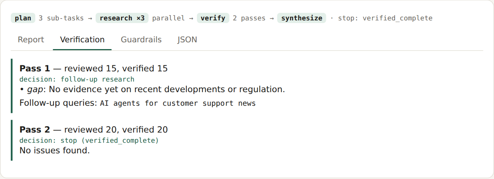
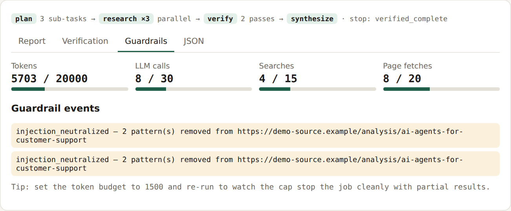

# Agentic Research Engine

Multi-agent AI engine built with **LangGraph** and **FastAPI**: parallel research agents, a self-verification loop, cited reports and capped outreach, with hard cost limits on every AI call.

**[▶ Live demos](https://agentic-research-engine-mf23.onrender.com)** · **[Research engine demo](https://agentic-research-engine-mf23.onrender.com/demos/research)** · **[API docs](https://agentic-research-engine-mf23.onrender.com/docs)**

Free hosting: if the site has been idle, the first load can take up to a minute.

## Try it in 2 minutes

1. Open the **[research demo](https://agentic-research-engine-mf23.onrender.com/demos/research)** and tap **Run research**. The *Verification* tab shows the verifier finding a gap and sending agents back for more research.
2. Set the token budget to **1500** and run again: the hard cap stops the job and returns partial results instead of overspending.
3. Create an outreach campaign asking for 5 follow-ups: the server caps it at 3.

## Four live demos

| Demo | What it shows |
|---|---|
| **[Agentic Research Engine](https://agentic-research-engine-mf23.onrender.com/demos/research)** | Planner → parallel research agents → verifier → capped re-research → cited report. Token, call and loop caps. Email / WhatsApp / SMS outreach with capped follow-ups |
| **[AI Support Agent](https://agentic-research-engine-mf23.onrender.com/demos/support)** | Answers from a knowledge base with sources, order and refund tools, human handoff, prompt-injection blocking |
| **[Document AI Extraction](https://agentic-research-engine-mf23.onrender.com/demos/extract)** | Invoices from text, PDF or a phone photo (OCR) → structured data, with maths checks and human review |
| **[Web Monitor Automation](https://agentic-research-engine-mf23.onrender.com/demos/monitor)** | Scrapes a competitor store, detects price and stock changes, sends alerts |

  
  

## Built to run safely in production

- **No runaway spend:** tokens are reserved *before* every AI call, with caps on calls, searches, loop passes and recursion.
- **Self-verification:** gaps, contradictions and unsupported claims trigger follow-up research. Invented citations are removed.
- **Security:** prompt-injection filtering, SSRF protection, rate limits, API keys, signed webhooks. Live mode refuses to run without an API key. Details in [SECURITY.md](SECURITY.md).
- **Quality:** 59 automated tests, and lint, security scan and dependency audit all clean.
- **Runs without keys:** demo mode needs no API keys. Add OpenAI or Anthropic plus Serper keys for live research.

<b>How this maps to a typical multi-agent engine brief</b>

Each requirement from a typical agentic-research brief, where it's built, and where to see it working:

| Requirement | Where it's built | Where to see it |
|---|---|---|
| Stateful orchestration with loop controls (LangGraph) | `app/research.py` (`build_graph`) | Demo pipeline strip: plan → research ×N → verify → synthesize |
| Parallel research: sub-tasks, search API, scraping, stored findings | `plan_node`, `research_node` (LangGraph `Send`), `app/tools.py`, `app/store.py` | Report tab, JSON tab (`findings`) |
| Self-verification: gaps, contradictions, unsupported claims → capped follow-up passes | `verify_node`, `route_after_verify` | Verification tab: pass 1 finds a gap, pass 2 stops clean |
| Structured, cited markdown reports | `synthesize_node` + citation check | Report tab, `GET /jobs/{id}/report` |
| Outreach drafts (Email / WhatsApp / SMS) | `app/outreach.py`, `app/channels.py` | Outreach section, channel selector |
| Scheduled, capped follow-ups for unresponsive contacts | `process_due` + APScheduler, server-side cap | Ask for 5 follow-ups → capped at 3 → `closed_no_reply` |
| FastAPI endpoints and webhooks to sync with a backend | `app/main.py`, HMAC-signed callbacks, inbound webhook | `/docs` |
| Hard token caps, loop limits, injection sanitization | `app/guardrails.py` | Guardrails tab; token budget 1500 → `budget_exceeded` |
| Modular codebase, `.env` config, OpenAPI docs | `app/*`, `.env.example`, auto OpenAPI | `/openapi.json`, 58 offline tests |

## Documentation

- [Architecture](docs/ARCHITECTURE.md): the agent graph, cost controls, guardrails and how to extend it
- [Developer guide](docs/DEVELOPER.md): local setup, API reference, configuration and deploying to Render
- [Security](SECURITY.md): threat model and controls

**Stack:** Python · LangGraph · FastAPI · OpenAI / Anthropic APIs · Serper · SendGrid / Twilio · SQLite · Render

MIT License
