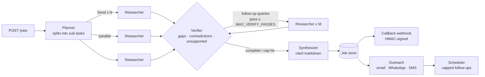

# Agentic Research Engine

A standalone, modular **multi-agent engine** with a FastAPI interface. It does four things:

- runs parallel web research,
- **verifies its own findings** in a capped loop,
- writes **cited markdown reports**,
- drafts personalised outreach with **hard-capped follow-ups**.

It is built with **LangGraph**. Every paid call passes through a budget guard before it runs.

> **Runs with zero API keys.** Without keys, the engine uses a deterministic mock mode, so the full pipeline is visible for free. Add an OpenAI/Anthropic key and a Serper key to switch to live research.

[](https://render.com/deploy?repo=https://github.com/designersgurus/agentic-research-engine)

**Live demo:** https://agentic-research-engine-mf23.onrender.com · **API docs:** `/docs` (Swagger) · `/redoc`

---

## Architecture



| Module | Responsibility |
|---|---|
| `app/research.py` | LangGraph state machine: plan → parallel research (`Send`) → verify → capped loop → synthesize |
| `app/guardrails.py` | `Budget` (token / LLM-call / search / scrape caps with reservations), prompt-injection sanitizer, SSRF guard |
| `app/llm.py` | Provider-agnostic client (OpenAI, Anthropic, mock) that enforces the budget before each call |
| `app/tools.py` | Serper search and page fetch with readable-text extraction |
| `app/outreach.py` | Personalised drafts, the follow-up state machine, reply/opt-out handling |
| `app/channels.py` | SendGrid (email) and Twilio (SMS/WhatsApp). **Dry-run by default** |
| `app/main.py` | FastAPI endpoints, background jobs, APScheduler, signed callbacks |
| `app/store.py` | SQLite document store (swap for Postgres in production) |

## How runaway spend is prevented

The engine uses several independent layers. If one fails, another still stops the run.

1. **Pre-call budget reservation.** Every LLM call reserves `estimated prompt + max_output` tokens *before* it runs, and the reservation is settled against real usage afterwards. Parallel branches cannot both slip under the cap and overshoot it together.
2. **Hard counters.** Each job has fixed limits on LLM calls, searches and page fetches.
3. **Loop caps.** Three limits bound the loop:
   - `MAX_VERIFY_PASSES` caps follow-up research rounds.
   - `MAX_FOLLOWUP_QUERIES` caps queries per round.
   - Follow-up queries that were already searched are removed.
   - LangGraph's `recursion_limit` is a final ceiling.
4. **Graceful stop.** When any cap is hit, the graph goes straight to synthesis. Synthesis falls back to a zero-cost template, so the job returns **partial results** marked `stopped_reason: "budget_exceeded"`. It never fails silently and never keeps spending.
5. **Requests can only tighten caps.** `max_passes` and `token_budget` in a request are clamped to the server limits.
6. **Concurrency cap.** `MAX_CONCURRENT_JOBS` limits how many jobs run at once.

## Prompt-injection and safety guardrails

- **Scraped text is cleaned and fenced.** Control and bidi characters are removed, instruction-like phrases are neutralised, and the text is wrapped in `<untrusted_data>` tags. The model is told to treat it strictly as data. The demo sources include a real injection attempt, which you can see neutralised on the Guardrails tab.
- **Contact notes are treated as untrusted** in outreach drafts.
- **Invented citations are stripped.** Any `[n]` in the report that doesn't map to a collected source is removed. Findings without a valid source are dropped.
- **SSRF guard.** Scraping and callbacks refuse private, loopback and link-local addresses.
- **Tool separation.** Research agents have no access to outreach tools. Sending only happens through an explicit API call.
- **Outreach is dry-run by default.** Follow-ups are capped per contact (server-side `OUTREACH_MAX_FOLLOWUPS_CAP`) and stop immediately on a reply, or on STOP / unsubscribe.

## Quick start

```bash
git clone https://github.com/designersgurus/agentic-research-engine
cd agentic-research-engine
pip install -r requirements.txt
cp .env.example .env          # optional — works without keys
uvicorn app.main:app --reload
# open http://localhost:8000  (demo UI)  ·  http://localhost:8000/docs  (Swagger)
pytest -q                      # 12 tests, all offline
```

## API

| Method | Path | Purpose |
|---|---|---|
| `POST` | `/jobs` | Start a research job → `202 {job_id}` |
| `GET` | `/jobs/{id}` | Status, report, findings, verification log, usage |
| `GET` | `/jobs/{id}/report` | Cited report as `text/markdown` |
| `GET` | `/jobs` | Recent jobs |
| `POST` | `/outreach/campaigns` | Draft and send first messages, schedule capped follow-ups |
| `GET` | `/outreach/campaigns/{id}` | Campaign with per-contact status and message history |
| `POST` | `/outreach/campaigns/{id}/contacts/{cid}/reply` | Record a reply or opt-out (stops follow-ups) |
| `POST` | `/outreach/webhooks/inbound` | Normalised inbound webhook from your email/SMS provider |
| `POST` | `/outreach/process-due` | Run the follow-up scheduler now (`force=true` for demos) |
| `GET` | `/health` | Active providers and configured caps |

```bash
curl -X POST $URL/jobs -H 'Content-Type: application/json' \
  -d '{"query":"AI agents for customer support","max_passes":2,"token_budget":20000,
       "callback_url":"https://your-backend.example/hooks/research"}'
```

Callbacks are sent as `POST` with `{"event":"job.finished","job":{...}}`. When `WEBHOOK_SECRET` is set, they are signed with `X-Signature-256: sha256=<hmac>`. When `API_KEY` is set, all write endpoints require the `X-API-Key` header.

## Configuration

All settings are environment variables. See [`.env.example`](.env.example) for the full list.

| Variable | Default | Meaning |
|---|---|---|
| `LLM_PROVIDER` | `auto` | `openai` / `anthropic` / `mock`. `auto` picks by which key is present |
| `SEARCH_PROVIDER` | `auto` | `serper` / `mock` |
| `JOB_TOKEN_BUDGET` | `60000` | Hard token cap per job |
| `MAX_LLM_CALLS` / `MAX_SEARCH_CALLS` / `MAX_SCRAPE_CALLS` | `30` / `15` / `20` | Per-job counters |
| `MAX_VERIFY_PASSES` | `2` | Follow-up research rounds the verifier may trigger |
| `GRAPH_RECURSION_LIMIT` | `40` | LangGraph super-step ceiling |
| `OUTREACH_DRY_RUN` | `true` | Record messages without sending them |
| `OUTREACH_MAX_FOLLOWUPS_CAP` | `3` | Server-side ceiling on follow-ups per contact |

## Deploy on Render

1. Click **Deploy to Render** above, or go to Render → **New → Blueprint** and select this repo. `render.yaml` configures everything.
2. Leave the key fields empty for mock mode, or add `OPENAI_API_KEY` / `ANTHROPIC_API_KEY` and `SERPER_API_KEY` for live research.
3. **Set `API_KEY` before adding real keys**, so a public URL can't spend your credits.

**Keep-alive.** Render's free tier sleeps after about 15 minutes without traffic. To prevent that, the app pings its own public URL (`RENDER_EXTERNAL_URL/ping`) every 5 minutes. It is built to stay light:
- It only runs when a public URL exists, so never locally or in tests.
- The interval can't be set below 4 minutes.
- Each ping is a single tiny request to `/ping`, with no database or LLM work.
- After 3 failures in a row, it backs off to one ping every 30 minutes.
- You can set `KEEPALIVE_ACTIVE_HOURS=7-23` to let it sleep overnight and save free instance hours.

Its status is shown under `keepalive` in `/health`.

Note: Render's disk resets on each deploy. For production, use Postgres and a worker. The engine's store and scheduler are isolated modules, so they can be swapped.

## Extending

- **New agent:** add a node to `build_graph()` in `app/research.py`. Route to it through a conditional edge, and pass shared services through `config["configurable"]["ctx"]`.
- **New channel:** add a branch to `send_message()` in `app/channels.py` and set its length limit in `CHANNEL_LIMITS`.
- **CrewAI:** the engine works the same way behind the API. The budget, sanitizer and store are framework-independent.

## License

MIT
