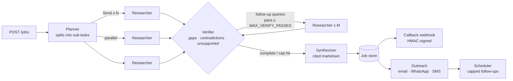

# Architecture

[← Back to README](../README.md)

## Architecture

| Module | Responsibility |
|---|---|
| `app/research.py` | LangGraph state machine: plan → parallel research (`Send`) → verify → capped loop → synthesize |
| `app/guardrails.py` | `Budget` (token / LLM-call / search / scrape caps with reservations), prompt-injection sanitizer, SSRF guard |
| `app/llm.py` | Provider-agnostic client (OpenAI, Anthropic, mock) that enforces the budget before each call |
| `app/tools.py` | Serper search and page fetch with readable-text extraction |
| `app/outreach.py` | Personalised drafts, the follow-up state machine, reply/opt-out handling |
| `app/channels.py` | SendGrid (email) and Twilio (SMS/WhatsApp). **Dry-run by default** |
| `app/main.py` | FastAPI endpoints, background jobs, APScheduler, signed callbacks |
| `app/store.py` | SQLite document store (swap for Postgres in production) |
| `app/security.py` | Rate limiting, client IP resolution, security headers |
| `app/demos/support.py` | Support agent graph: guard → route → act (retrieval or tools) → respond |
| `app/demos/extract.py` | Invoice / receipt / PO field extraction, validation rules, approve-or-review decision |
| `app/demos/ocr.py` | Safe file intake (type sniffing, size and pixel caps) and OCR with deskewed line grouping |
| `app/demos/monitor.py` | Scraper, snapshot diffing and alert formatting for the web-monitor demo |

## How runaway spend is prevented

The engine uses several independent layers. If one fails, another still stops the run.

1. **Pre-call budget reservation.** Every LLM call reserves `estimated prompt + max_output` tokens *before* it runs, and the reservation is settled against real usage afterwards. Parallel branches cannot both slip under the cap and overshoot it together.
2. **Hard counters.** Each job has fixed limits on LLM calls, searches and page fetches.
3. **Loop caps.** Three limits bound the loop:
   - `MAX_VERIFY_PASSES` caps follow-up research rounds.
   - `MAX_FOLLOWUP_QUERIES` caps queries per round.
   - Follow-up queries that were already searched are removed.
   - LangGraph's `recursion_limit` is a final ceiling.
4. **Graceful stop.** When any cap is hit, the graph goes straight to synthesis. Synthesis falls back to a zero-cost template, so the job returns **partial results** marked `stopped_reason: "budget_exceeded"`. It never fails silently and never keeps spending.
5. **Requests can only tighten caps.** `max_passes` and `token_budget` in a request are clamped to the server limits.
6. **Concurrency cap.** `MAX_CONCURRENT_JOBS` limits how many jobs run at once.

## Prompt-injection and safety guardrails

- **Scraped text is cleaned and fenced.** Control and bidi characters are removed, instruction-like phrases are neutralised, and the text is wrapped in `<untrusted_data>` tags. The model is told to treat it strictly as data. The demo sources include a real injection attempt, which you can see neutralised on the Guardrails tab.
- **Contact notes are treated as untrusted** in outreach drafts.
- **Invented citations are stripped.** Any `[n]` in the report that doesn't map to a collected source is removed. Findings without a valid source are dropped.
- **SSRF guard.** Scraping and callbacks refuse private, loopback and link-local addresses.
- **Tool separation.** Research agents have no access to outreach tools. Sending only happens through an explicit API call.
- **Fail-safe live mode.** If any live key or live sending is enabled while `API_KEY` is unset, every write endpoint refuses with `503`.
- **Abuse limits.** Per-IP rate limit, job backlog cap, 24-hour data retention, and listing endpoints disabled in open demo mode.
- **Hardened HTTP.** Strict CSP, `X-Frame-Options`, HSTS, and SSRF checks on every redirect hop. See [SECURITY.md](../SECURITY.md) for the full threat model.
- **Outreach is dry-run by default.** Follow-ups are capped per contact (server-side `OUTREACH_MAX_FOLLOWUPS_CAP`) and stop immediately on a reply, or on STOP / unsubscribe.

## Extending

- **New agent:** add a node to `build_graph()` in `app/research.py`. Route to it through a conditional edge, and pass shared services through `config["configurable"]["ctx"]`.
- **New channel:** add a branch to `send_message()` in `app/channels.py` and set its length limit in `CHANNEL_LIMITS`.
- **CrewAI:** the engine works the same way behind the API. The budget, sanitizer and store are framework-independent.
